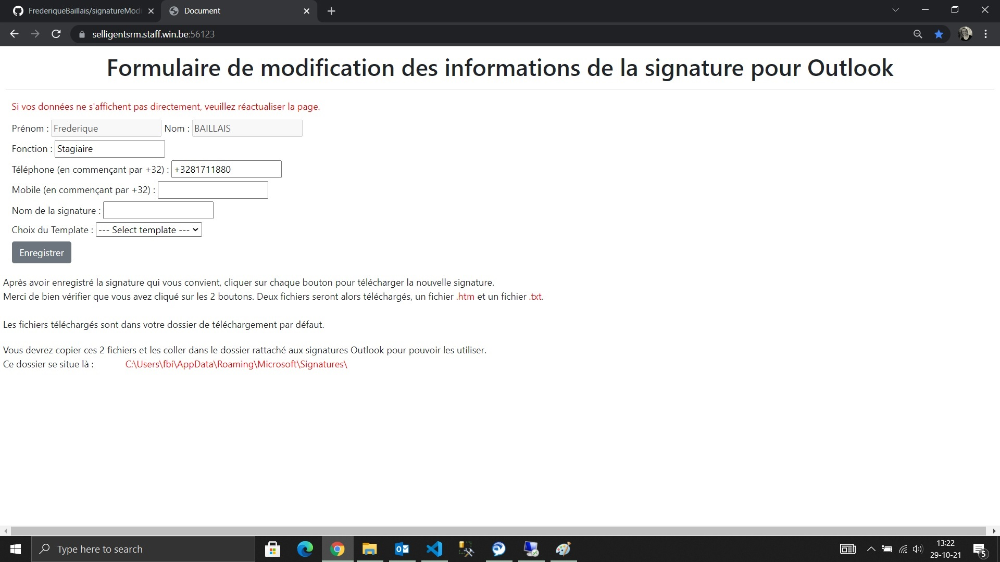
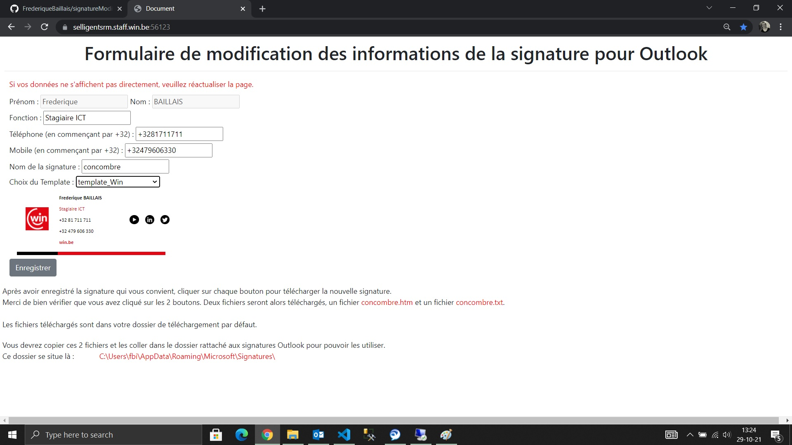
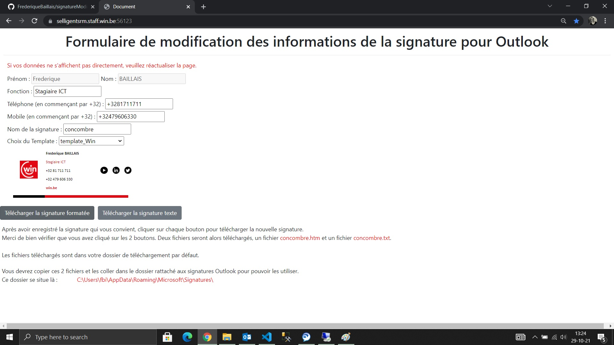
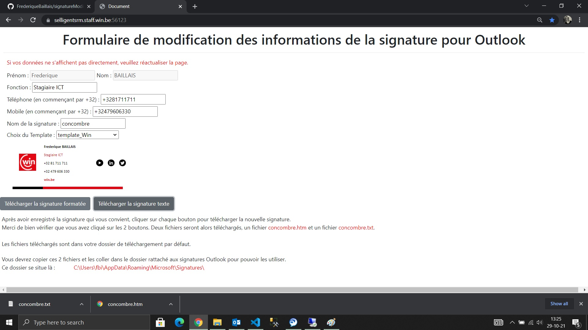
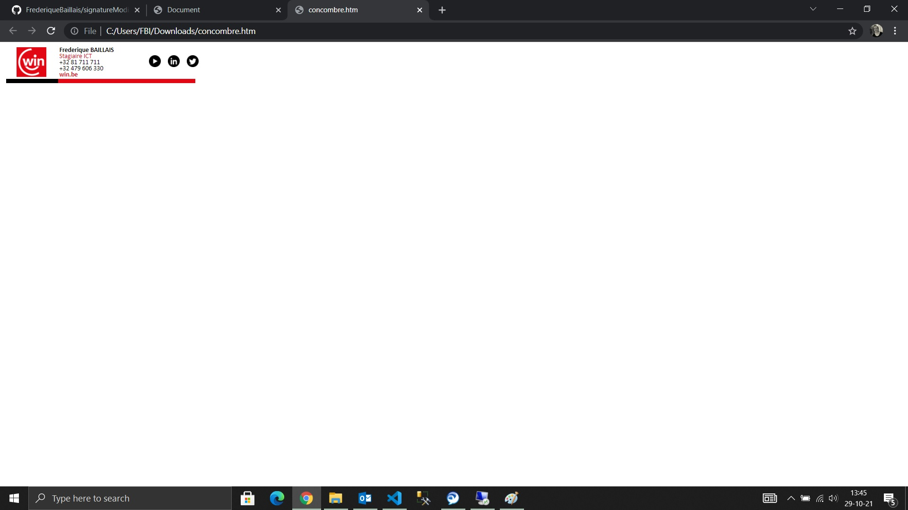
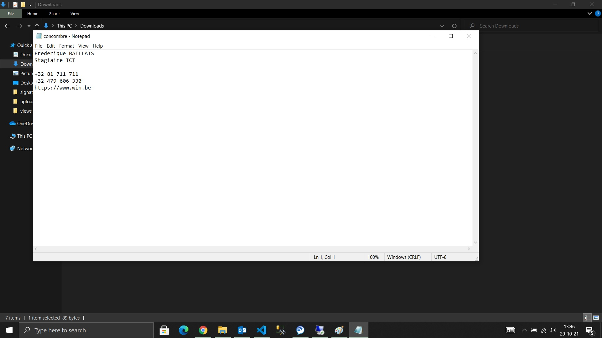

# signatureModifyWithLdap
Node.js modify signature using LDAP

1er visuel :
On arrive sur cette page où on nous propose de modifier certaines informations. Seuls les champs nom et prénom sont non modifiables.

2ème visuel :
On modifie ce que l'on veut, on choisit le template approprié.

3ème visuel :
On enregistre lorsque tout est ok. On nous propose alors de télécharger les fichiers créés.

4ème visuel :
On télécharge les 2 fichiers.

5ème visuel :
Le template .htm téléchargé ressemble à ceci.

6ème visuel :
Le visuel .txt téléchargé ressemble à ceci.

Les fichiers créés sont alors ceux-ci :

[concombre.htm](./public/concombre.htm) et [concombre.txt](./public/concombre.txt)
